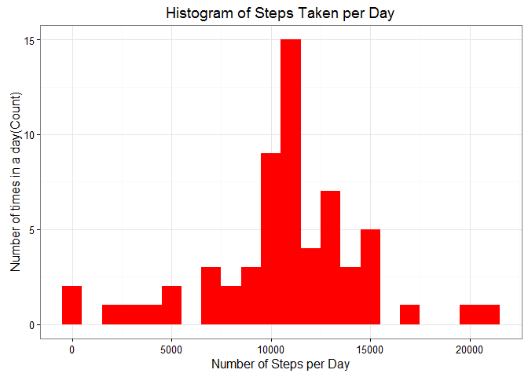

Overview
--------

This document compiled the results of peer assessments 1, Module 5
Reproducible Research on Coursera. This assignment makes use of data
from a personal activity monitoring device and forked from the
instructor's (R.D. Peng) gitHub repo at
<http://github.com/rdpeng/RepData_PeerAssessment1>.

This assignment looked at data from a device that collects data at 5
minute intervals through out the day. The data consists of two months of
data from an anonymous individual collected during the months of October
and November, 2012 and include the number of steps taken in 5 minute
intervals each day.

This results for this Peer Assessment 1 is reported using in a single R
markdown document that can be processed by knitr and be transformed into
an HTML file.

This document comprised of SEVEN sections that : 1.Prepared the R studio
environment and loading the required libraries 2.Loading the data for
pre analysis processing 3.Tidying the data prior to analysis 4.Answer to
what is mean total number of steps taken per day ? 5.Answer to What is
the average daily activity pattern? 6.Imputing missing values 7.Answer
to are there differences in activity patterns between weekdays and
weekends?

***Note to self : This Rmd file should be in the same folder as the data
file, or it may not WORK !***

1.Preparing the R Studio environment and loading the required libraries :
-------------------------------------------------------------------------

Throughout this report when writing code chunks in the R markdown
document, always use echo = TRUE so that someone else will be able to
read the code.

To do this, set echo to 'TRUE' and results equal a 'hold' as global
options for this document.

    library(knitr)
    opts_chunk$set(echo = TRUE, results = 'hold')

Loading the libraries

    library(data.table)

    ## Warning: package 'data.table' was built under R version 3.2.5

    library(ggplot2)  # using the ggplot2 for plotting functions

    ## Warning: package 'ggplot2' was built under R version 3.2.5

2.Loading the data for pre analysis processing
----------------------------------------------

Loading the required data

The following statement is used to load the data using read.csv().

**Note**: It is assumed that the file activity.csv is in the current
working directory. File can be downloaded from
[here](https://d396qusza40orc.cloudfront.net/repdata%2Fdata%2Factivity.zip)

    rdata <- read.csv('activity.csv', header = TRUE, sep = ",",
                      colClasses=c("numeric", "character", "numeric"))

3.Tidying the data prior to analysis
------------------------------------

Proceed to convert the date field to Date class and interval field to
Factor class. Next check the data using str() method.

    rdata$date <- as.Date(rdata$date, format = "%Y-%m-%d")
    rdata$interval <- as.factor(rdata$interval)
    str(rdata)

    ## 'data.frame':    17568 obs. of  3 variables:
    ##  $ steps   : num  NA NA NA NA NA NA NA NA NA NA ...
    ##  $ date    : Date, format: "2012-10-01" "2012-10-01" ...
    ##  $ interval: Factor w/ 288 levels "0","5","10","15",..: 1 2 3 4 5 6 7 8 9 10 ...

4.Answer to what is mean total number of steps taken per day ?
--------------------------------------------------------------

Calculating the total steps per day.

    steps_per_day <- aggregate(steps ~ date, rdata, sum)
    colnames(steps_per_day) <- c("date","steps")
    head(steps_per_day)

    ##         date steps
    ## 1 2012-10-02   126
    ## 2 2012-10-03 11352
    ## 3 2012-10-04 12116
    ## 4 2012-10-05 13294
    ## 5 2012-10-06 15420
    ## 6 2012-10-07 11015

Next, draw a histogram of the total number of steps taken per day,
plotted with binwidth of 1000.

    ggplot(steps_per_day, aes(x = steps)) + 
           geom_histogram(fill = "blue", binwidth = 1000) + 
            labs(title="Histogram of Steps Taken per Day", 
                 x = "Number of Steps per Day", y = "Number of times in a day(Count)") + theme_bw() 

Proceed to calculate the ***MEAN*** and ***MEDIAN*** of the number of
steps taken per day.

    steps_mean   <- mean(steps_per_day$steps, na.rm=TRUE)
    steps_median <- median(steps_per_day$steps, na.rm=TRUE)

Calculation for mean is given by **10766.189** and median is **10765**.

5.Answer to What is the average daily activity pattern?
-------------------------------------------------------

Calculate the total steps taken by intervals of 5-minutes and convert
the intervals as integers and save them in a data frame called
`steps_per_interval`.

    steps_per_interval <- aggregate(rdata$steps, 
                                    by = list(interval = rdata$interval),
                                    FUN=mean, na.rm=TRUE)
    #convert to integers
    steps_per_interval$interval <- 
            as.integer(levels(steps_per_interval$interval)[steps_per_interval$interval])
    colnames(steps_per_interval) <- c("interval", "steps")

Proceed to plot with the time series of the average number of steps
taken (averaged across all days) versus the 5-minute intervals:

    ggplot(steps_per_interval, aes(x=interval, y=steps)) +   
            geom_line(color="blue", size=1) +  
            labs(title="Average Daily Activity Pattern", x="Interval", y="Number of steps") +  
            theme_bw()

Next, we look for the 5-minute interval containing the maximum number of
steps:

    max_interval <- steps_per_interval[which.max(  
            steps_per_interval$steps),]

The **835th** interval has maximum **206** steps.

6.Imputing missing values:
--------------------------

### i. Total number of missing values:

The total number of missing values in steps can be calculated using
`is.na()` method to check whether the value is mising or not and then
summing the logical vector.

    missing_vals <- sum(is.na(rdata$steps))

The total number of ***missing values*** is given by **2304**.

### ii. Strategy for filling in all of the missing values in the dataset

To fill up missing values, we can replace them with the mean value at
the same interval across days.

Create a function `na_fill(data, pervalue)` which the `data` arguement
is the `rdata` data frame and `pervalue` arguement is the
`steps_per_interval` data frame.

    na_fill <- function(data, pervalue) {
            na_index <- which(is.na(data$steps))
            na_replace <- unlist(lapply(na_index, FUN=function(idx){
                    interval = data[idx,]$interval
                    pervalue[pervalue$interval == interval,]$steps
            }))
            fill_steps <- data$steps
            fill_steps[na_index] <- na_replace
            fill_steps
    }

    rdata_fill <- data.frame(  
            steps = na_fill(rdata, steps_per_interval),  
            date = rdata$date,  
            interval = rdata$interval)
    str(rdata_fill)

    ## 'data.frame':    17568 obs. of  3 variables:
    ##  $ steps   : num  1.717 0.3396 0.1321 0.1509 0.0755 ...
    ##  $ date    : Date, format: "2012-10-01" "2012-10-01" ...
    ##  $ interval: Factor w/ 288 levels "0","5","10","15",..: 1 2 3 4 5 6 7 8 9 10 ...

The next chunck of code checks whether there are any missing values
remaining or not

    sum(is.na(rdata_fill$steps))

    ## [1] 0

***Zero output shows that there are NO MISSING VALUES***.

### iii. A histogram of the total number of steps taken each day

Proceed to plot a histogram of the daily total number of steps taken,
plotted with a bin interval of 1000 steps, after filling missing values.

    fill_steps_per_day <- aggregate(steps ~ date, rdata_fill, sum)
    colnames(fill_steps_per_day) <- c("date","steps")

    ##plotting the histogram
    ggplot(fill_steps_per_day, aes(x = steps)) + 
           geom_histogram(fill = "red", binwidth = 1000) + 
            labs(title="Histogram of Steps Taken per Day", 
                 x = "Number of Steps per Day", y = "Number of times in a day(Count)") + theme_bw() 

### iv. Calculate and report the **mean** and **median** total number of steps taken per day.

    steps_mean_fill   <- mean(fill_steps_per_day$steps, na.rm=TRUE)
    steps_median_fill <- median(fill_steps_per_day$steps, na.rm=TRUE)

The mean is **10766.189** and median is **10766.189**.

### Do these values differ from the estimates from the first part of the assignment?

Yes, these values do differ slightly.

-   **Before filling the data**
    1.  Mean : **10766.189**
    2.  Median: **10765**
-   **After filling the data**
    1.  Mean : **10766.189**
    2.  Median: **10766.189**

We see that the values after filling the data, mean and median are
equal.

### What is the impact of imputing missing data on the estimates of the total daily number of steps?

Comparing with the calculations done in the first section of this
document, we observe that while the mean value remains unchanged, the
median value has become EQUAL to the mean.

Our data is showing a greater peak, consistent with a student-t
distribution. This shows that imputing missing values has increased the
frequencies of mean and adjusted the median to be EQUAL to the mean.

### 7.Answer to are there differences in activity patterns between weekdays and weekends?

We do this comparison with the table with filled-in missing values.  
1.Augment the table with a column that indicates the day of the week  
2.Subset the table into two parts - weekends (Saturday and Sunday) and
weekdays (Monday through Friday).  
3.Tabulate the average steps per interval for each data set.  
4.Plot the two data sets side by side for comparison.

    weekdays_steps <- function(data) {
        weekdays_steps <- aggregate(data$steps, by=list(interval = data$interval),
                              FUN=mean, na.rm=T)
        # convert to integers for plotting
        weekdays_steps$interval <- 
                as.integer(levels(weekdays_steps$interval)[weekdays_steps$interval])
        colnames(weekdays_steps) <- c("interval", "steps")
        weekdays_steps
    }

    data_by_weekdays <- function(data) {
        data$weekday <- 
                as.factor(weekdays(data$date)) # weekdays
        weekend_data <- subset(data, weekday %in% c("Saturday","Sunday"))
        weekday_data <- subset(data, !weekday %in% c("Saturday","Sunday"))
        
        weekend_steps <- weekdays_steps(weekend_data)
        weekday_steps <- weekdays_steps(weekday_data)
        
        weekend_steps$dayofweek <- rep("weekend", nrow(weekend_steps))
        weekday_steps$dayofweek <- rep("weekday", nrow(weekday_steps))
        
        data_by_weekdays <- rbind(weekend_steps, weekday_steps)
        data_by_weekdays$dayofweek <- as.factor(data_by_weekdays$dayofweek)
        data_by_weekdays
    }

    data_weekdays <- data_by_weekdays(rdata_fill)

Below you can see the panel plot comparing the average number of steps
taken per 5-minute interval across weekdays and weekends:

    ggplot(data_weekdays, aes(x=interval, y=steps)) + 
            geom_line(color="orange") + 
            facet_wrap(~ dayofweek, nrow=2, ncol=1) +
            labs(x="Interval", y="Number of steps") +
            theme_bw()

Its obvious that activity on the weekday has the greatest peak from all
steps intervals. However, weekends activities has more peaks over a
hundred compared to weekday.
